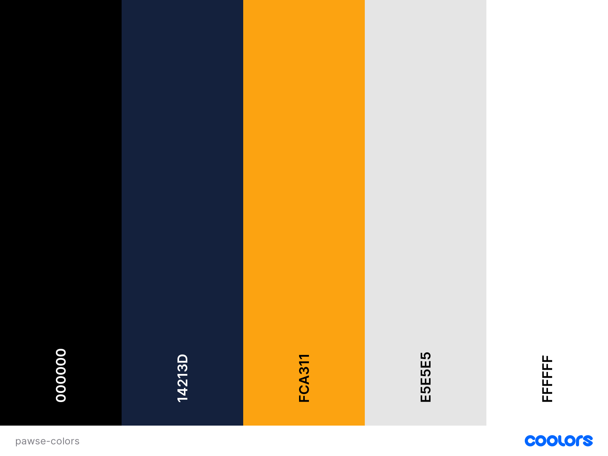
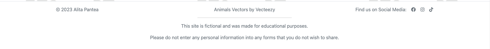
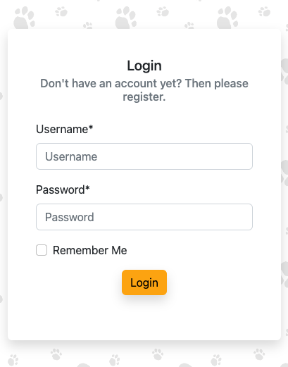
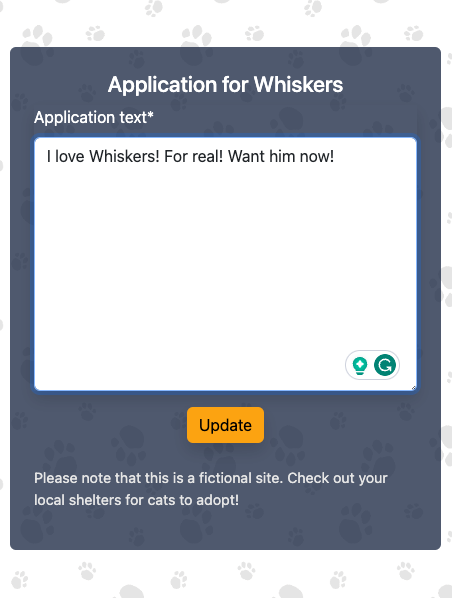

# Pawse - Introduction

Pawse is a full-stack website project for a cat cafe. 

It is a remake of the HTML & CSS only website ["In the Meowment"](https://hashtag-squirrel.github.io/in-the-meowment/), which was made earlier this year, as a showcase of my progression as a coder. 

This project was made from scratch, only taking the idea of the previous cat cafe website and fleshing it out from the ground up. 

[Pawse Live Site](https://pawse-4504aa9c3705.herokuapp.com/)

## Table of Contents

- [Pawse - Introduction](#pawse---introduction)
  - [Table of Contents](#table-of-contents)
  - [UX](#ux)
    - [Strategy \& Scope: User Stories](#strategy--scope-user-stories)
    - [Structure: Site flow](#structure-site-flow)
    - [Skeleton: Wireframes](#skeleton-wireframes)
    - [Surface: Visual Design](#surface-visual-design)
      - [Colors](#colors)
      - [Fonts](#fonts)
      - [Logo](#logo)
      - [Background image](#background-image)
  - [Database Design](#database-design)
  - [Agile Development](#agile-development)
  - [Features](#features)
    - [Existing Features](#existing-features)
      - [General](#general)
      - [Apps](#apps)
      - [CRUD](#crud)
      - [User Feedback](#user-feedback)
      - [Custom Error Pages](#custom-error-pages)
    - [Future Features](#future-features)
  - [Technologies](#technologies)
    - [Languages](#languages)
    - [Frameworks \& Libraries](#frameworks--libraries)
    - [Other Tools](#other-tools)
  - [Testing \& Validation](#testing--validation)
  - [Deployment \& Development](#deployment--development)
    - [Deployment on Heroku](#deployment-on-heroku)
    - [Local Deployment](#local-deployment)
  - [Credits](#credits)
    - [Media](#media)
    - [Code](#code)

## UX

### Strategy & Scope: User Stories

| **Epic**                               | **User Story**                                                                                                                        |
|----------------------------------------|---------------------------------------------------------------------------------------------------------------------------------------|
| Unauthenticated User Features          | As a user, I want to see a navigation menu so that I can easily navigate to the desired content                                       |
|                                        | As a user, I want to see an inviting landing page so that I know what the page is about and what I can do                             |
|                                        | As a user, I want to see all menu options of the cafe so that I can make an informed decision if I want to visit                      |
|                                        | As a user, I want to see the cats living in the cafe so that I can already familiarize myself with them before my visit               |
|                                        | As a user, I want to see whether there are already people interested in the cats so that I can choose one accordingly                 |
|                                        | As a user, I want to be able to register to the site so that I get access functionality for authenticated users on the site           |
|                                        | As a user, I want to be able to login so I can access my account                                                                      |
|                                        | As a user, I want to have easy access to social media accounts of the cafe so that I can engage with the owners and other customers   |
| Authenticated User Features            | As an authenticated user, I want to be able to log out of my account so that my account is secure from other users on the same device |
|                                        | As an authenticated user, I want to be able to delete my account so that I can forget about the page                                  |
|                                        | As an authenticated user, I want to be able to voice my interest in one of the cats so that I can adopt it                            |
|                                        | As an authenticated user, I want to be able to edit my interest in one of the cats                                                    |
|                                        | As an authenticated user, I want to be able to delete my interest in one of the cats                                                  |
| Site Admin Features                    | As a site admin, I want to be able to log in to my admin account so that I can make changes to the content on the site                |
|                                        | As a site admin, I want to be able to adjust the menu from the frontend so that it is always up to date                               |
|                                        | - As a site admin, I want to be able to add new menu items from the frontend                                                          |
|                                        | - As a site admin, I want to be able to edit menu items from the frontend                                                             |
|                                        | - As a site admin, I want to be able to delete menu items from the frontend                                                           |
|                                        | As a site admin, I want to be able to adjust the kittens from the frontend so that customers always see the current kittens           |
|                                        | - As a site admin, I want to be able to add new cats from the frontend                                                                |
|                                        | - As a site admin, I want to be able to edit cats from the frontend                                                                   |
|                                        | - As a site admin, I want to be able to delete cats from the frontend                                                                 |
| Authenticated User/Site Admin Features | As an authenticated user/site admin I want to see feedback from my actions so that I know my action was successful                    |
|                                        | As an authenticated user/site admin I want to be asked to confirm deletion so that I don't accidentally delete something wrong        |
| Site Owner Features                    | As a site owner, I want the site to be visually pleasing so that users like to come back/share it                                     |

The target audience for the site consists of people 13 and above who want to meet cats and have a drink and/or some food.
Parts of the target audience may want to meet cats outside of their home because they can't have cats of their own.
Other parts of the target audience may want to meet cats they can adopt.
And even other parts may just want to hang out with cats and friends. 

### Structure: Site flow

The website consists of four main pages that can be accessed via the nav bar. 

Additional functionalities can be accessed from the nav bar or as subpages, depending on whether a user is signed in or not and depending on the user role. 

This sitemap chart shows the high-level flow of the site: 

### Skeleton: Wireframes

The wireframes for the different pages can be divided into unauthenticated users, authenticated users and site admins.

EDIT: The site admin UI CRUD functionality was not implemented, since full UI CRUD functionality was already covered with the Authenticated User features, therefore the wireframes were not used. 

1. Home

| **Page Version**                  | **Mobile**              | **Desktop**                   |
|-----------------------------------|-------------------------|-------------------------------|
| Unauthenticated                   |  |  |
| Unauthenticated - nav expanded |  |   |
| Authenticated                     | Same as unauthenticated |  |
| Authenticated - nav expanded   |  | Same as Unauthenticated with nav expanded, but with Authenticated nav bar options |
| Site Admin                        | Same version as authenticated | Same version as authenticated |

2. Menu

| **Page Version**       | **Mobile**              | **Desktop**             |
|------------------------|-------------------------|-------------------------|
| Unauthenticated        |  |  |
| Authenticated          | Same as unauthenticated | Same as unauthenticated |
| Site Admin             | N/A                     |  |
| Site Admin - Add/Edit Menu Item     | N/A                     |  |
| Site Admin - Add/Edit Menu Category | N/A                     |  |

3. Cats

| **Page Version**               | **Mobile** | **Desktop** |
|--------------------------------|------------|-------------|
| Unauthenticated                |  |  |
| Authenticated                  |  |  |
| Authenticated - added interest |  |  |
| Site Admin                     | N/A        |  |
| Site Admin - Add/Edit Cat                   | N/A        |  |

4. Sign Up/Sign In/My Account

| **Page Version**               | **Mobile** | **Desktop** |
|--------------------------------|------------|-------------|
| Unauthenticated - Sign Up                |  |  |
| Unauthenticated - Sign In                |  |  |
| Authenticated - My Account             |  |  |

### Surface: Visual Design

#### Colors

I was not fully satisfied with the color scheme used on my first cat cafe project, I felt the colors were a little stuffy, so I wanted to have a fresh look for this project.

My goal was to have a more elegant and modern look for the page, light and inviting with colors that pop. 

I tried different color palettes using Coolors.co and first ended up with [this palette](https://coolors.co/283d3b-197278-ffffff-c44536-772e25) using red and teal tones with a simple white background. However, I felt the teal and red were a little too heavy. 

I tried [another palette](https://coolors.co/palette/000000-14213d-fca311-e5e5e5-ffffff) from the same site and am much happier with the result:

#### Fonts

Building on the idea of a minimalistic modern look and feel of the site, I wanted simple fonts for the site. 

For any flowing text, I picked [Karla](https://fonts.google.com/specimen/Karla?preview.text=Welcome%20to%20our%20cafe&preview.text_type=custom&category=Sans+Serif), an elegant but playful sans serif font. 

For the headings on the page, I picked [Raleway](https://fonts.google.com/specimen/Raleway?preview.text=Pawse&preview.text_type=custom&category=Sans+Serif), which is also very minimalistic and sans serif. 

#### Logo

The logo design is based on the name of the cafe, which is a pun made of paws of a cat and pause like a break. Therefore, the logo is a stylized cat paw with a pause sign on the big circle. 

#### Background image

During the design, I felt a simple white background was a little boring, so I decided to add a background image that is playful, but not too distracting from the main content. 

I found a repeating background with differently sized paw prints, which I deemed very fitting. I adjusted the color of the paws to match the light grey of my color palette to make it fit in perfectly. 

Most content is then highlighted by a card directly on the background or by a card contained in a dark blue semi-transparent box to give some contrast. 

## Database Design

The Entity Relationship Diagram shows the basic structure of the database.

During development, the entities and their fields were changed based on the needs that came up. 

Here is the initial ERD:

And here is the updated version, reflecting the current state of the models:

The User model is provided by Django.

The MenuCategory and MenuItem models are utilized to display the menu list divided by category and holds information about the price of the different items as well. An update made during development was to add in an the "order" field on the MenuCategory model, which is used to display the categories in a specified order on the website. 

The Cat model is used to store all relevant information about the cats of the cafe, including the name, date of birth, description and an image of the cat. Additionally, the Application model holds information about any application sent in by the users for any cats. 

The Cat model was updated during development to include a slug field, which was needed to display the correct application. 

## Agile Development

The project was planned and carried out using Agile methodologies. The tool used for this was GitHub Issues. 

[Kanban boards](https://github.com/users/hashtag-squirrel/projects/2) were set up to track tickets through statuses Backlog, Todo, In Progress and Done. 

Two boards were set up: [A Task/User Story board](https://github.com/users/hashtag-squirrel/projects/2/views/1) and an [Epic board](https://github.com/users/hashtag-squirrel/projects/2/views/4). This was done to keep track of the different types of issues separately. 

When planning out the User Stories, they were grouped into Epics and all were created as issues in GitHub Issues using custom templates. The Tasks and User Stories were linked to the Epics as needed. Tasks were created for features that were not covered by User Stories, but needed for the project, e.g. the planning of the project and the general setup, as well as polishing/bug fixing tickets later on in the project. 

The Epics and their related tickets were split up into several [Milestones](https://github.com/hashtag-squirrel/pawse/milestones?state=closed), which represented approximately one week long sprints. Initially, I planned eight sprints, but condensed the last three milestones into one big milestone lasting for more than one week. There was also a phase at the end of Sprint 5 where I went back to the planning board and planned out the remaining tickets for the last milestone. 

| Sprint | Content                                             | Start      | End        |
|--------|-----------------------------------------------------|------------|------------|
| 1      | Planning                                            | 2023-07-19 | 2023-07-25 |
| 2      | Initial Setup, Unauthenticated User Features Part 1 | 2023-07-26 | 2023-08-01 |
| 3      | Unauthenticated User Features Part 2                | 2023-08-02 | 2023-08-06 |
| 4      | Authenticated User Features                         | 2023-08-09 | 2023-08-18 |
| 5      | Site Admin and Site Owner Features                  | 2023-08-18 | 2023-08-23 |
| 6      | Testing, polishing and bug fixes                    | 2023-08-28 | 2023-09-10 |

In order to keep best track over the time needed for the tickets, I created a [Roadmap](https://github.com/users/hashtag-squirrel/projects/2/views/2?groupedBy%5BcolumnId%5D=Milestone) displaying the milestones and their respective tickets, which is shown here:

At the start of every sprint, I checked the tickets belonging to the respective milestone and added Acceptance Criteria for every ticket, as well as an estimate in Story Points. I also made sure that every ticket was prioritized according to MoSCoW prioritization and tagged appropriately. 

The goal of the planning was to even out the work I had to do over all sprints and when I generated a chart with Story Points per Sprint, I can see that it worked out quite well. Sprint 6 was expected to have more storypoints since it lasted about twice as long as other sprints. 

I also checked that each sprint had no more than 40% of tickets that were categorized as anything else than must-haves. 

## Features

### Existing Features

#### General

- Navigation/Header

The Header includes the site logo to instantly make the page recognizable, as well as a simple navigation bar including links to all pages. Depending on whether a user is logged in or not, they see links to Register/Login as an unauthenticated user or a link to Logout as an authenticated user. 

The navigation links are highlighted in the signature yellow color when hovering with the mouse and the active link is highlighted with a darker font color.  

Desktop view:

 

Desktop view with active link (Pawse) and hovered link (Menu):

On mobile/smaller screens, the navigation elements switch to a hamburger menu, which shows the same navigation links when clicked on:

 

- Footer

The footer contains several different parts. 

The first container includes copyright information, a link to the site providing the background image as well as some social media links. 

The second container includes two disclaimers, firstly about the fictionality of the page and secondly to not provide any personal information in forms. 

Visually, the footer is separated from the main content of the page by a light grey top border and a white background, as opposed to the background image on the main content of the page. The font in the footer is kept in a light grey to not distract from the main content. 

The links in the footer are highlighted the same way as in the header. 

 

On mobile screens, the footer elements move to one column:

- Account Pages - Login, Logout Register

The Account pages are all designed in a similar way, with a simple card including a form (Login/Register) or including a confirmation button (Logout). They adhere to the main design of the page and have a bright yellow button on all pages as a pop of color. 

The Registration does not require an email address, because I wanted to avoid collection personal data from users. This is also the reason why there is no option to change the password via a "Forgot Password" link, since this would require an email address. 

The Account pages all redirect the user back to the previous page they navigated to before trying to login/register/logout, for a nicer user experience. 

#### Apps

- Pages App - Landing Page

The Pages App has one view, which is the Landing Page. It is divided into three main sections:

  - Hero video section

The hero video section features a full screen video on autoplay without sound. It is set to respond responsively and is always sized to 100% of the viewport height. 
The video shows a cat licking its mouth and eating. 

It features some text overlay including a welcome message in the signature yellow and a short description of what Pawse is about. 

The description is shortened on mobile devices in order to not cover too much of the screen.

  - Testimonials section

The Testimonials section shows a couple of testimonials about the cafe to give visitors a better picture of what the cafe is like and make them more inclined to visit the cafe.

It shows each testimonial on a card as a card group on a dark blue semi-transparent box. Each card has a quote icon in the signature yellow to give a pop of color. 

The section is designed fully responsive and shows two or three cards depending on screen size. To avoid having a layout with two rows with a different number of cards, the tablet sized screen hides the last card. 

On mobile, all three cards are shown again as one column.

  - Find Us section

Lastly, the landing page has a Find Us section. 

It is separated from the testimonials by a 25% width horizontal rule as a visual divider. It has a headline and then features an embedded map which spans the full viewport width. The map has a pointer on Stockholm, since this is the city I live in and the cafe doesn't actually exist. 

Below the map, there is a card group on the dark blue semi-transparent box again with Details. The first card features the Contact Details of the cafe and the second card has information that is good to know before a visit. Both cards have a yellow icon on the top left, similar to the testimonials section. 

On Mobile, the cards stack into one column again.

- Menu App - Menu Page

The Menu App has one view as well, which is the Menu Page. It consists of only one section, which features the dark blue semi-transparent box with a white heading and cards below showing the menu options based on the menu category. The number of cards shown is determined by the number of menu categories the site admin specifies in the backend. 

The menu items show a name highlighted in a darker shade of the yellow for readability, the price and a short description. Menu items can also be managed by the site admin in the backend. 

Depending on the screen size, the number of cards shown in a row changes. On tablets it shows two cards per row:

And on mobile it shows one card per row:

- Cats App - Cats Page, Application Pages

The Cats App has several views. Firstly, it has the Cats Page and the different Application Pages.

For unauthenticated users, the cats page shows one section, which is the cat carousel. 

The carousel has navigation buttons on each side as well as a navigation bar at the bottom. It consists of one card per cat. The card is divided into an image of the cat with a zoom-in effect when navigating to that cat, to give the user a more emotional feeling. Below the image, there is a section with the name, age and description of the cat, as well as an indicator how many applications have come in for that cat. 

Below that is a yellow call to action button to apply to adopt a cat. When an unauthenticated user clicks the apply button, they are taken to the Login page.

Authenticated users see the cat carousel as well, but if they have an active application for a cat, the application button is disabled and has a message that the user has applied for this cat already.

Below the carousel, authenticated users can also keep track of their applications and the details of them, in the same style as other sections before. Here they can also click a button to edit or delete the applications. 

On mobile, the carousel is getting narrower and the cards move into one column again. 

#### CRUD

The authenticated user can leverage full CRUD functionality in the UI of the Cats. 

They can Create, Read, Update and Delete applications from here. 

To create an application, the user can click on the big CTA button that says "Apply to adopt CAT now", which brings them to the application screen, which looks the same on all screen sizes. 

The form is only asking for an application text to showcase the functionality, in a real-world scenario this form might ask for additional details like name, contact details, application status etc. As mentioned previously, I wanted to avoid collecting personal data as much as possible. 

From the applications on the Cats Page, the user can click on Edit to update their application for a cat, which brings them to a similar form as the application form, containing their previously entered data and an "Update" button.

From the same place, the user can click on Delete to delete their application for a cat, which brings them to a confirmation screen.

#### User Feedback

For a better user experience, the site features Bootstrap alerts for the Create, Update and Delete functionality, as well as for any account actions(login, logout, register). The latter comes with the allauth library.

The success messages for the C(R)UD functionality:

It also shows an error message if someone tries to add a second application for the same cat:

And this is what the account messages look like:

The messages are set to appear at the top of the main tag and disappear automatically after 3000 milliseconds, leaving enough time for the user to read the messages.

#### Custom Error Pages

Two custom error pages were added to the project, to make it easy for the user to navigate back to the landing page after a 404 (Page not found) or 500 (Server Error) error. The pages look the same and feature a topical image of a cat, as well as a prominent yellow "Back to Home" button.

### Future Features

Additionally to more content that could be added to the existing pages, there are many features that can be added to flesh out the project. Here is a list of potential features that can be added with varying amounts of work:

Unauthenticated User features:
- Adding an Articles page where information about the cats/cafe/news can be shared
- A gallery with more impressions of the cafe

Authenticated User features:
- An Account overview page
- The possibility to delete one's own account
- Adding comments on the cats
- Adding testimonials after a visit
- A booking system for visits
- A messaging system to discuss details/status of applications

Site Admin features in the UI:
- Add/Edit/Delete Menu items/sections
- Add/Edit/Delete Cats

## Technologies

### Languages

- HTML5
- CSS3
- JavaScript
- Python 3.11

### Frameworks & Libraries

- Bootstrap v5.2
- Django v3.2

Django libraries:

- gunicorn 
- dj-database-url
- psycopg2 
- dj3-cloudinary-storage
- urllib3
- pillow
- django-allauth
- django-autoslug
- django-crispy-forms
- crispy-bootstrap5
- django-active-link

Test coverage:
- coverage

To create a virtual environment:
- pipenv

### Other Tools

- Git - used for version control
- GitHub - used for online storage of codebase and GitHub Issues tool
- VS Code - used as the coding editor of choice
- Balsamiq - for creation of the wireframes
- Lucidchart - used to create diagrams
- ElephantSQL - used to host the PostgreSQL database
- Cloudinary - as static file storage
- Heroku - used to host the application
- WAVE - to evaluate the accessibility of the site.
- [RGB to Hex converter](https://www.rgbtohex.net/) - to convert color codes

## Testing & Validation

All testing and validation is documented in [TESTING.md](TESTING.md)

## Deployment & Development

### Deployment on Heroku

1. Login to the Heroku dashboard and create a new app.
2. Navigate to Settings and add the Python Buildpack
3. Set environment variables in the Config Vars section of the Settings tab.
   - You need to define the following variables:
     - `DATABASE_URL` - `<Your Postgres URL>`
     - `CLOUDINARY_URL` - `<Your Cloudinary URL>`
     - `SECRET_KEY` - `<Your Secret Key>`
4. Connect your GitHub repository to your Heroku app.
5. In the Deploy tab, enable automatic deploys from your GitHub repository using the "main" branch.
6. Click the "Deploy Branch" button to deploy the "main" branch.
7. Once the app has been deployed, click the "View App" button to view the app.

### Local Deployment

1. Clone the repository from GitHub by clicking the "Code" button and copying the URL.
2. Open your preferred IDE and open a terminal session in the directory you want to clone the repository to.
3. Type `git clone` followed by the URL you copied in step 1 and press enter.
4. Create a virtual environment typing `pipenv shell` in your terminal
5. Install the required dependencies specified in the Pipfile by typing `pipenv install` in the terminal.
6. Note: The project is setup to use environment variables. You will need to set these up in your local environment.
  - For local deployment, you will need to create an `env.py` file in the root directory of the project and set the environment variables in this file as follows:
    - `os.environ['DATABASE_URL'] = '<Your Postgres URL>'`
    - `os.environ['SECRET_KEY'] = '<Your Secret Key>'`
    - `os.environ['CLOUDINARY_URL'] = '<Your Cloudinary URL>'`
    - `os.environ["DEBUG"] = 'DEBUG'`
7. Connect your database of choice and run the migrations by typing `python manage.py migrate` in the terminal.
8. Create a superuser by typing `python manage.py createsuperuser` in the terminal and following the prompts.
9.  Run the app by typing `python manage.py runserver` in the terminal and opening the URL in your browser.

## Credits

Text content for the following sections were generated by OpenAIs ChatGPT-3.5 (July 20 version):

- Landing page: About section, Testimonials section and Contact section
- Menu page: Menu items
- Cats page: Cat names and descriptions

### Media

- [Base for the logo:](https://pixabay.com/vectors/paw-print-dog-cat-animal-pet-5892565/)
- [Hero image on home page](https://pixabay.com/photos/cat-mammal-animal-cafe-pet-feline-8101641/)
- [Hero video on home page](https://coverr.co/videos/a-grey-and-white-cat-licks-its-lips-otuDwMne0G)
- [Whiskers](https://www.pexels.com/photo/orange-cat-in-close-up-photography-9443839/)
- [Luna](https://www.pexels.com/photo/a-tuxedo-cat-on-a-hanging-wooden-bridge-7726104/)
- [Oliver](https://www.pexels.com/photo/brown-cat-lying-on-knitted-textile-952581/)
- [Amber](https://www.pexels.com/photo/close-up-photo-of-sitting-brown-tabby-cat-2373663/)
- [Mocha](https://www.pexels.com/photo/cute-cat-lying-on-sofa-4154508/)
- [Simba](https://www.pexels.com/photo/fluffy-ginger-cat-15511201/)
- [Repeatable Paw Vector](https://www.vecteezy.com/vector-art/2469425-seamless-pattern-with-animal-paw-prints-gray-paws-on-a-white-background-vector-illustration-endless-background)
- [Cat image on 404 page](https://www.pexels.com/photo/orange-tabby-cat-hiding-its-face-209037/)
- [Cat image on 500 page](https://pixabay.com/photos/cat-black-cat-work-computer-963931/)

### Code

- [Sticky Footer Tutorial](https://devpractical.com/bootstrap-sticky-footer/)
- [How to add a second model in a view](https://www.appsloveworld.com/django/100/28/refer-to-multiple-models-in-view-template-in-django)
- [Calculation for age from days](https://www.codesansar.com/python-programming-examples/convert-number-days-years-months-days.htm)
- [Custom template tag for cats page](https://stackoverflow.com/questions/31916408/is-django-can-modify-variable-value-in-template)
- [Redirect to same page after login/logout/register](https://stackoverflow.com/a/13595154)