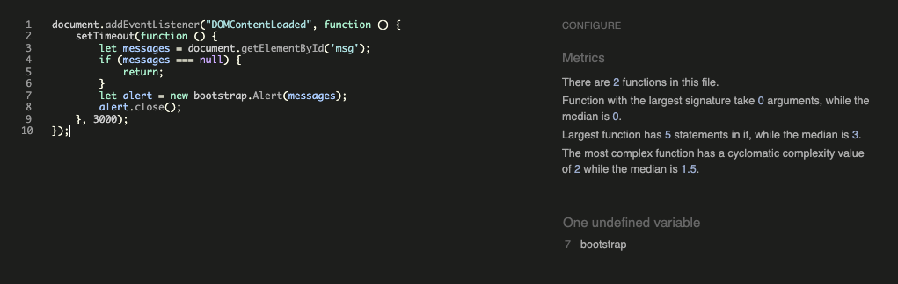
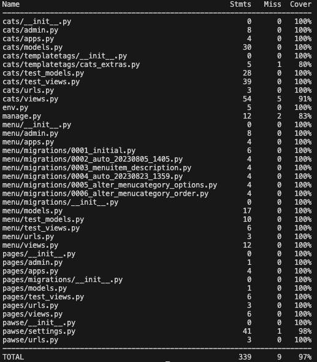

# Table of Contents

- [Table of Contents](#table-of-contents)
  - [Responsiveness Testing](#responsiveness-testing)
  - [Browser Compatibility Testing](#browser-compatibility-testing)
  - [Bug Testing](#bug-testing)
  - [Lighthouse Testing](#lighthouse-testing)
  - [Code Valitation](#code-valitation)
    - [HTML Validation](#html-validation)
      - [Landing page](#landing-page)
      - [Menu page](#menu-page)
      - [Cats page](#cats-page)
      - [Cat application pages](#cat-application-pages)
      - [Login, Logout and Register pages](#login-logout-and-register-pages)
    - [CSS Validation](#css-validation)
    - [JavaScript Validation](#javascript-validation)
    - [Python Validation](#python-validation)
      - [Pawse Project](#pawse-project)
      - [Pages App](#pages-app)
      - [Menu App](#menu-app)
      - [Cats App](#cats-app)
  - [User Story Testing](#user-story-testing)
  - [Feature Testing](#feature-testing)
  - [Automated Testing](#automated-testing)

## Responsiveness Testing

## Browser Compatibility Testing

## Bug Testing

## Lighthouse Testing

## Code Valitation

### HTML Validation

All pages were checked with the [W3 HTML checker](https://validator.w3.org/nu/). 
Since parts of the pages are generated server-side, the pages were checked using the deployed version on Heroku, using the option to "View Page Source" in Chrome and inputting the source code for each page separately into the text input on the W3 Checker. 

At first, several pages had a couple of errors and warnings, but all errors and warnings were fixed until the checker showed none for every page as seen in below image:

#### Landing page
The landing page showed an error with a missing div end tag. The tag was identified and added. 
It also showed the error that the width for the iframe with the embedded map was set to a percentage instead of an absolute number. This was fixed by moving the style information to the stylesheet instead.

#### Menu page
The menu page showed an error with a wrong header end tag. It had an h5 end tag, but the header was an h4. The end tag was fixed accordingly. 
It also showed an error with p end tag which could not be correctly matched to the p tag with the class of card-text. This was fixed by changing the tag into a div, which is more appropriate anyways.

#### Cats page
The cats page showed several errors. It showed an error that an a element must not appear as descendant of a button element, which appeared five times on the generated cat cards. This was fixed by adding the button classes directly to the a tag instead and removing the button tags altogether. 
It also showed errors with some div end tags missing and too much, which was fixed by identifying all divs and checking that they had the appropriate end tags.
Lastly, it showed a warning that the application section didn't contain a header. I am not sure why it showed this, because it does contain an h4, just not as a direct child. Either way, this was fixed by changing the section into a div. 

#### Cat application pages
None of the cat application pages showed errors or warnings. 

#### Login, Logout and Register pages

These all showed the same warning that the trailing slash on self-closing tags does not have any effect. The trailing slash was removed on all pages. 

### CSS Validation

CSS was validated using the [Jigsaw validator from W3C](https://jigsaw.w3.org/css-validator/validator). No errors were found.

### JavaScript Validation

The custom JavaScript was validated using [JSHint](https://jshint.com/) which showed no errors. 

### Python Validation

The CI Python Linter was used to validate the Python files created or edited for the Django project. Unchanged project files and settings.py were not validated.

No errors came up for any of the files. Click on the links below to see screenshots of the results. 

#### Pawse Project

- [urls.py](static/docs/python-validation/pawse-urls.png)

#### Pages App

- [test_views.py](static/docs/python-validation/pages-test-views.png)
- [urls.py](static/docs/python-validation/pages-urls.png)
- [views.py](static/docs/python-validation/pages-views.png)

admin.py and models.py were not used.

#### Menu App

- [admin.py](static/docs/python-validation/menu-admin.png)
- [models.py](static/docs/python-validation/menu-models.png)
- [test_models.py](static/docs/python-validation/menu-test-models.png)
- [test_views.py](static/docs/python-validation/menu-test-views.png)
- [urls.py](static/docs/python-validation/menu-urls.png)
- [views.py](static/docs/python-validation/menu-views.png)

#### Cats App

- [admin.py](static/docs/python-validation/cats-admin.png)
- [models.py](static/docs/python-validation/cats-models.png)
- [test_models.py](static/docs/python-validation/cats-test-models.png)
- [test_views.py](static/docs/python-validation/cats-test-views.png)
- [urls.py](static/docs/python-validation/cats-urls.png)
- [views.py](static/docs/python-validation/cats-views.png)

On urls.py the `noqa` tag was used on the line importing the views, since I deemed it less readable if I split this up on several lines.

## User Story Testing

| **Epic**                               | **User Story**                                                                                                                        | Testing Method & Expected Outcome                                                                                                                                                                                                                                                                                                                                                                                                                                                                                                                                                                                                                                                       | Result                                                                                     | Comment |
|----------------------------------------|---------------------------------------------------------------------------------------------------------------------------------------|-----------------------------------------------------------------------------------------------------------------------------------------------------------------------------------------------------------------------------------------------------------------------------------------------------------------------------------------------------------------------------------------------------------------------------------------------------------------------------------------------------------------------------------------------------------------------------------------------------------------------------------------------------------------------------------------|--------------------------------------------------------------------------------------------|---------|
| Unauthenticated User Features          | As a user, I want to see a navigation menu so that I can easily navigate to the desired content                                       | 1. Navigating to the website on a desktop/laptop and seeing a navigation bar with navigation elements 1a. When hovering over the links, they should be highlighted as feedback to the user of being clickable 1b. When clicking on a link, the user should be taken to the linked page 1c. The active page should be highlighted in the nav bar 2. Navigating to the website on a mobile device and seeing a hamburger menu 2a. When clicking on the hamburger menu, the nav bar should open and show all links 2b. When clicking on a link, the user should be taken to the linked page 2c. The active page should be highlighted when the hamburger menu is open | 1. Pass 1a. Pass 1b. Pass 1c. Pass 2. Pass 2a. Pass 2b. Pass 2c. Pass |         |
|                                        | As a user, I want to see an inviting landing page so that I know what the page is about and what I can do                             | 1. When navigating to the website, a hero image or hero video should be shown to the user that sets the topic of the site 2. There should be a short description for the user about what the page is about 3. The links in the nav bar should be self-explanatory                                                                                                                                                                                                                                                                                                                                                                                                                 | 1. Pass 2. Pass 3. Pass                                                              |         |
|                                        | As a user, I want to see all menu options of the cafe so that I can make an informed decision if I want to visit                      | 1. When navigating to the Menu page, the user should see all choices 2. The choices should be sorted by category 3. The choices should include proper descriptions                                                                                                                                                                                                                                                                                                                                                                                                                                                                                                                | 1. Pass 2. Pass 3. Pass                                                              |         |
|                                        | As a user, I want to see the cats living in the cafe so that I can already familiarize myself with them before my visit               | 1. When navigating to the Cats page, the user should see images of all the cats 2. The cats should also have a description so the user knows a bit about them if wanted                                                                                                                                                                                                                                                                                                                                                                                                                                                                                                              | 1. Pass 2. Pass                                                                         |         |
|                                        | As a user, I want to see whether there are already people interested in the cats so that I can choose one accordingly                 | 1. When navigating to the Cats page, the user should see the current number of applications for any cat                                                                                                                                                                                                                                                                                                                                                                                                                                                                                                                                                                                 | 1. Pass                                                                                    |         |
|                                        | As a user, I want to be able to register to the site so that I get access functionality for authenticated users on the site           | 1. Navigating the website, the user should have access to a link to register from any page in the nav bar 2. When clicking on Register, the user should be taken to a form that asks for username, password and repetition of password 3. After registering, the user should be logged in automatically                                                                                                                                                                                                                                                                                                                                                                           | 1. Pass 2. Pass 3. Pass                                                              |         |
|                                        | As a user, I want to be able to login so I can access my account                                                                      | 1. Navigating the website, the user should have access to a link to login from any page in the nav bar                                                                                                                                                                                                                                                                                                                                                                                                                                                                                                                                                                                  | 1. Pass                                                                                    |         |
|                                        | As a user, I want to have easy access to social media accounts of the cafe so that I can engage with the owners and other customers   | 1. Navigating the website, the user should be able to find the social media links of the cafe at any point 2. The social media navigation links should behave the same as the main nav bar when hovering over the links 3. Clicking on a social media link should open the page in a new tab                                                                                                                                                                                                                                                                                                                                                                                      | 1. Pass 2. Pass 3. Pass                                                              |         |
| Authenticated User Features            | As an authenticated user, I want to be able to log out of my account so that my account is secure from other users on the same device | 1. When logged in, the logout link should be accessible from any page in the nav bar 2. When clicking on logout, the user should be prompted to confirm the action                                                                                                                                                                                                                                                                                                                                                                                                                                                                                                                   | 1. Pass 2. Pass                                                                         |         |
|                                        | As an authenticated user, I want to be able to delete my account so that I can forget about the page                                  |                                                                                                                                                                                                                                                                                                                                                                                                                                                                                                                                                                                                                                                                                         |                                                                                            |         |
|                                        | As an authenticated user, I want to be able to voice my interest in one of the cats so that I can adopt it                            |                                                                                                                                                                                                                                                                                                                                                                                                                                                                                                                                                                                                                                                                                         |                                                                                            |         |
|                                        | As an authenticated user, I want to be able to edit my interest in one of the cats                                                    |                                                                                                                                                                                                                                                                                                                                                                                                                                                                                                                                                                                                                                                                                         |                                                                                            |         |
|                                        | As an authenticated user, I want to be able to delete my interest in one of the cats                                                  |                                                                                                                                                                                                                                                                                                                                                                                                                                                                                                                                                                                                                                                                                         |                                                                                            |         |
| Site Admin Features                    | As a site admin, I want to be able to log in to my admin account so that I can make changes to the content on the site                |                                                                                                                                                                                                                                                                                                                                                                                                                                                                                                                                                                                                                                                                                         |                                                                                            |         |
|                                        | As a site admin, I want to be able to adjust the menu from the frontend so that it is always up to date                               |                                                                                                                                                                                                                                                                                                                                                                                                                                                                                                                                                                                                                                                                                         |                                                                                            |         |
|                                        | - As a site admin, I want to be able to add new menu items from the frontend                                                          |                                                                                                                                                                                                                                                                                                                                                                                                                                                                                                                                                                                                                                                                                         |                                                                                            |         |
|                                        | - As a site admin, I want to be able to edit menu items from the frontend                                                             |                                                                                                                                                                                                                                                                                                                                                                                                                                                                                                                                                                                                                                                                                         |                                                                                            |         |
|                                        | - As a site admin, I want to be able to delete menu items from the frontend                                                           |                                                                                                                                                                                                                                                                                                                                                                                                                                                                                                                                                                                                                                                                                         |                                                                                            |         |
|                                        | As a site admin, I want to be able to adjust the kittens from the frontend so that customers always see the current kittens           |                                                                                                                                                                                                                                                                                                                                                                                                                                                                                                                                                                                                                                                                                         |                                                                                            |         |
|                                        | - As a site admin, I want to be able to add new cats from the frontend                                                                |                                                                                                                                                                                                                                                                                                                                                                                                                                                                                                                                                                                                                                                                                         |                                                                                            |         |
|                                        | - As a site admin, I want to be able to edit cats from the frontend                                                                   |                                                                                                                                                                                                                                                                                                                                                                                                                                                                                                                                                                                                                                                                                         |                                                                                            |         |
|                                        | - As a site admin, I want to be able to delete cats from the frontend                                                                 |                                                                                                                                                                                                                                                                                                                                                                                                                                                                                                                                                                                                                                                                                         |                                                                                            |         |
| Authenticated User/Site Admin Features | As an authenticated user/site admin I want to see feedback from my actions so that I know my action was successful                    |                                                                                                                                                                                                                                                                                                                                                                                                                                                                                                                                                                                                                                                                                         |                                                                                            |         |
|                                        | As an authenticated user/site admin I want to be asked to confirm deletion so that I don't accidentally delete something wrong        |                                                                                                                                                                                                                                                                                                                                                                                                                                                                                                                                                                                                                                                                                         |                                                                                            |         |
| Site Owner Features                    | As a site owner, I want the site to be visually pleasing so that users like to come back/share it                                     |                                                                                                                                                                                                                                                                                                                                                                                                                                                                                                                                                                                                                                                                                         |                                                                                            |         |

## Feature Testing

## Automated Testing

Automated tests were written for all three apps: pages, menu and cats. 

The coverage for these apps is as follows:

